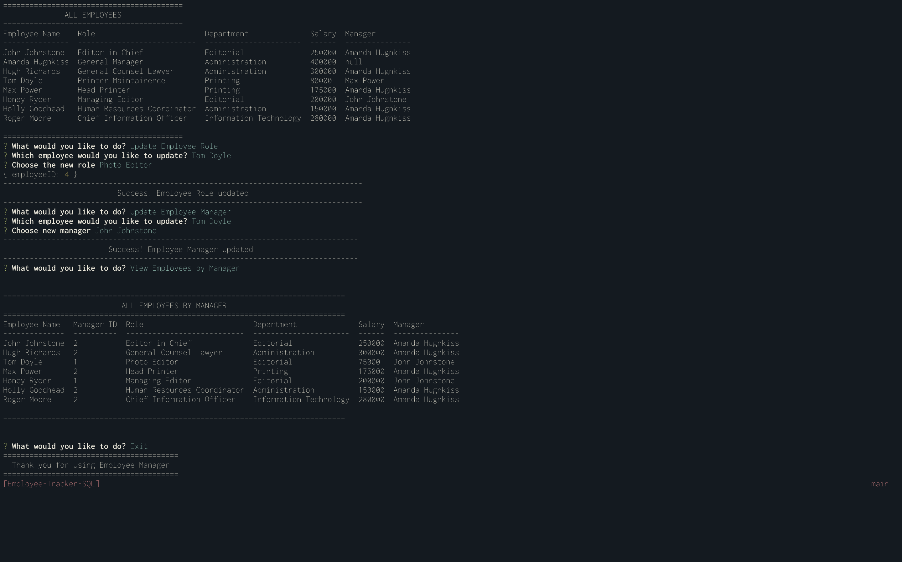

# Employee-Tracker-SQL


## Description 
Our clients were looking for a simple way to manage their employee database.  We developed this no mess, no fuss solution for them to use.

A couple of bonus features were added:
- Update Employee Managers
- View Employees by Manager

[Walkthrough Video](https://drive.google.com/file/d/1cQRbyAcQpU_t5M4_aa0lSpqrJDiRlhxR/view?usp=sharing)



## Installation
```npm i``` will install the application along with required dependancies.
There is a Schema and Seed files for database deployment and population included in the 'db' folder

## Usage
Run ```npm start``` then follow the prompts.

## Technologies
- Node.js, using inquirer, MySQL, ASCII Art-Logo, Console Table, DotENV & Util packages 
- SQL

## License 
This project is licensed under 

For more information, please visit: https://opensource.org/licenses/MIT
